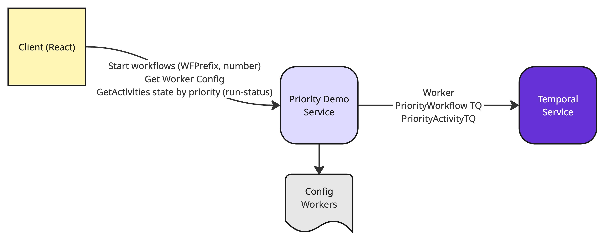

# Demonstration of priority queues in Temporal

This simple demonstration is designed to showcase how priority queues operate in Temporal.  

he application is deployed into two components, a react frontend using Vite that allows the user to specify a prefix to use in a test and how many workflows to run in order to demonstrate the priority queue management.  I have found that with 5 executor threads in the application 100 workflows is enough to showcase the feature clearly.  The Server side is implemented using Java Springboot with the configuration of the workers exposed in the application.yaml file.  The general deployment topology is shown below.



# Setup namespace with search attributes needed.
Using the latest dev server (1.4 or higher, or from docker-compose repo 1.28.1 or higher) set the configuration `matching.useNewMatcher` as mentioned in [pre-release docs](https://docs.google.com/document/d/1FnBZRjlz0eWGWk_bVLmQ3eZOTOJRFO4s4utGdQtWkIQ/edit?tab=t.0). 
Assuming you are using the auto-setup [docker-compose](https://github.com/temporalio/docker-compose) config then add the following to your dynamicconfig
```
matching.useNewMatcher:
  - value: true
    constraints:
       namespace: default
```
Ensure that you have added the search attributes Priority and ActivitiesCompleted both of type int to the namespace used.  These are needed for the demo.
```
temporal --address localhost:7233 --namespace default operator search-attribute create --name Priority --type int
temporal --address localhost:7233 --namespace default operator search-attribute create --name ActivitiesCompleted --type int
```

# Run the application


